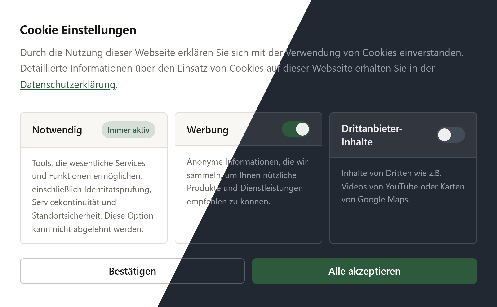

# Contao Cookie Consent Bundle

[](https://packagist.org/packages/numero2/contao-cookie-consent)
[](http://www.gnu.org/licenses/lgpl-3.0)

A cookie consent solution for Contao CMS - the drop-in replacement for the cookie consent functionality of [Contao Marketing Suite](https://github.com/numero2/contao-marketing-suite).

---

## Screenshot



> <sub>Cookie Consent in Light and Dark mode</sub>

---

## Requirements

- [Contao](https://github.com/contao/contao) **5.7 or newer**

---

## Installation

Via **Contao Manager** or **Composer**:

```bash
composer require numero2/contao-cookie-consent
```

---

## Insert Tags

Use these insert tags directly in your Contao templates and content elements to control cookie consent dependent output.

| Tag                | Description                                                                                                                                                                      |
|--------------------|----------------------------------------------------------------------------------------------------------------------------------------------------------------------------------|
| `{{cc_optinlink}}` | Renders a link that reopens the cookie consent dialog, allowing the user to adjust their consent. After confirming, the page scrolls back to the original element automatically. |
| `{{ifoptin::*}}`   | Wraps content that is only shown if the user **has accepted** the specified tag. Replace `*` with the tag ID.                                                                    |
| `{{ifnoptin::*}}`  | Wraps content that is only shown if the user **has not accepted** the specified tag. Replace `*` with the tag ID.                                                                |

### Examples

```
{{ifoptin::6}}<p>You have accepted ACME cookies.</p>{{ifoptin}}

{{ifnoptin::6}}<p>Please accept ACME cookies to see this content.</p>{{ifnoptin}}
```

---

## Styling

### Colors

Colors can be customized via CSS custom properties. Example:

```css
cc-cookie-consent, cc-cookie-optin {
    --cc-accent: #f47c00;
}
```

> A full list of available CSS custom properties can be found in [contao/templates/styles/cc_default.html.twig](contao/templates/styles/cc_default.html.twig).

### Color scheme

By default, both elements follow the color scheme defined by the user's operating system or browser.
If your page layout requires a specific scheme, it can be enforced via a custom template:

```twig



```

---

## Developer API

This bundle exposes helper utilities to check cookie consent status programmatically - both in PHP/Symfony and in Twig templates.

### PHP / Symfony

Inject the `numero2_cookie_consent.util.cookie_consent` service into your controller or service:

```php
// src/Controller/MyCustomController.php
namespace App\Controller;

use numero2\CookieConsentBundle\Util\CookieConsentUtil;

class MyCustomController
{
    public function __construct(
        private readonly CookieConsentUtil $cookieConsentUtil
    ) {}

    public function __invoke(): void
    {
        // Returns true if the tag with ID 6 has been accepted
        $this->cookieConsentUtil->isTagAccepted(6);

        // Returns true if the tag with ID 6 has NOT been accepted
        $this->cookieConsentUtil->isTagNotAccepted(6);

        // Generates a link that triggers the consent dialog
        $this->cookieConsentUtil->generateConsentForceLink();
    }
}
```

### Twig

Three global Twig functions are available:

```twig
{# Show content only if tag ID 6 was accepted #}

    <p>Analytics is enabled.</p>


{# Show content only if tag ID 6 was NOT accepted #}

    <p>Please enable Analytics to see this content.</p>


{# Render a link that opens the consent dialog (optional: custom CSS ID) #}
{{ cc_consent_force_link('customCSSId') }}
```

---

## Disclaimer

### Cookie storage

This bundle manages cookie consent on behalf of your Contao installation. Any cookies set during the consent process belong to **your website** - no data is transmitted to or stored by us.

The following cookies are set by this bundle:

| Cookie             | Value                 | Lifetime                        | Purpose                                              |
|--------------------|-----------------------|---------------------------------|------------------------------------------------------|
| `cc_cookies_saved` | `true`                | 7 days by default, configurable | Stores whether the user has made a consent decision. |
| `cc_cookies`       | List of tag group IDs | 7 days by default, configurable | Stores which tag groups the user has accepted.       |

#### Consent Logs
This bundle does not maintain any server-side logs of individual user consent. As the extension does not require user accounts, it is technically impractical to link a consent decision to a specific individual or IP address. Instead, user consent - or rejection - is recorded exclusively via a cookie stored on the user’s device. This approach ensures that consent can be reliably verified for each user while avoiding the storage of personal data on the server, in line with GDPR principles of data minimization and privacy by design.

### Legal stuff

Please use this bundle at your own risk. Whether your specific setup is legally compliant is something we cannot assess - if you're uncertain, a lawyer is the right contact. For technical questions, though, we're happy to help.